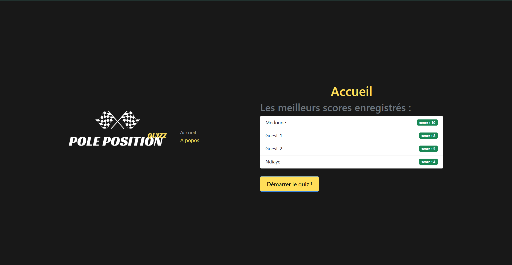
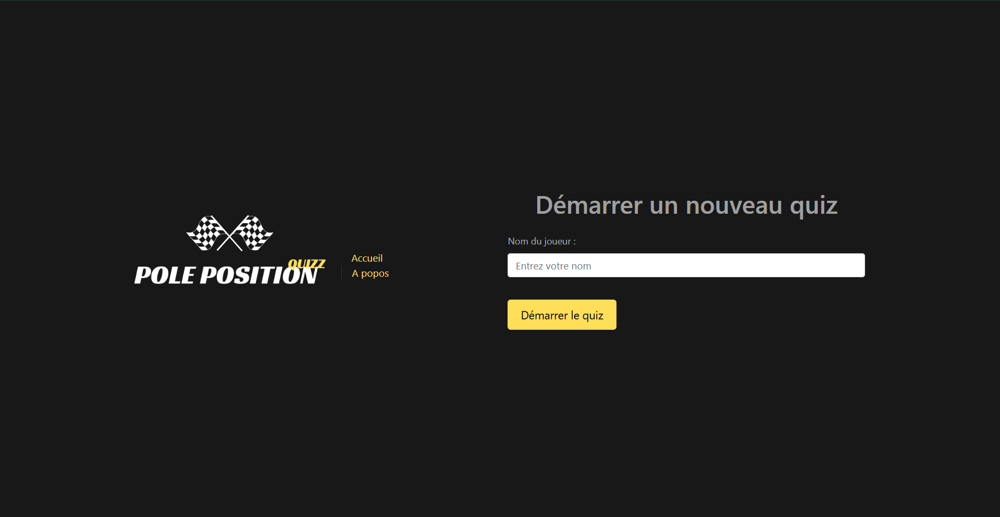
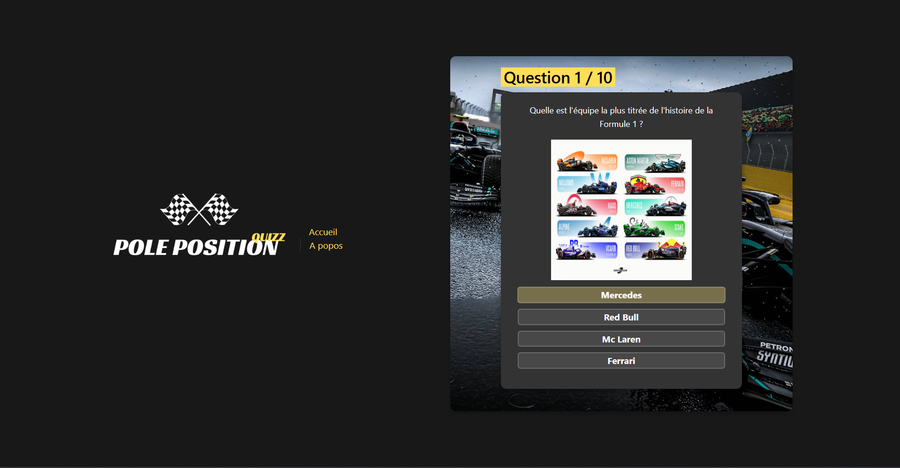

# 🏎️ Formula 1 Quiz App

Une application web interactive permettant aux passionnés de Formule 1 de tester leurs connaissances à travers un quiz dynamique et ludique.

##  Fonctionnalités

- 🔢 Quiz avec questions à choix multiples
- 🏁 Thème centré sur l’univers de la Formule 1
- 🧠 Calcul du score à la fin de chaque session
- 🎨 Interface utilisateur intuitive et responsive
- 🛠️ Déploiement facilité avec Docker

##  Aperçu






## Technologies utilisées

- Frontend : HTML, CSS, JavaScript, Vue.Js
- Backend : Python, Flask
- Base de données : PostgreSQL
- Conteneurisation : Docker / Docker Compose

##  Lancer le projet en local

### Prérequis

- [Node.js](https://nodejs.org/) installé
- [Docker & Docker Compose](https://www.docker.com/products/docker-desktop)

### Étapes

```bash
# Cloner le dépôt
git clone https://github.com/ton-nom-utilisateur/formula1-quiz-app.git
cd formula1-quiz-app

# Lancer l'application avec Docker
docker compose up
```

L'application sera disponible à l'adresse : http://localhost:3000 (ou autre port selon config)

### Auteurs
Ndongo Medoune Ndiaye
Ryan KHOU
Clément A.
